# Khata App 📖

A local-first **khata (ledger) and bill management app** for small shop
owners — a digital replacement for the paper notebook shopkeepers use to
track what customers owe and pay. Built for a semi-literate, one-handed,
mid-conversation user: large tap targets, minimal typing, glanceable
balances, full Urdu/English support with RTL — and it works with **zero
internet connection**, forever.

Product spec: [`docs/Khata_app-Guide.pdf`](docs/Khata_app-Guide.pdf) (v1.0) — the source of truth for scope; everything below implements it.

<p align="center">
  
</p>

---

## Screenshots

The images below are the pixel-matched design reference set the UI was built
against (see `design/` and the Phase 7 redesign notes in
[`roadmap.md`](.claude/docs/roadmap.md)), not live device captures — this
project's on-device screenshot tooling is blocked by a test-device `adb`
restriction (see the phase-7 notes), so the design references are the most
accurate visual representation available.

<table>
<tr>
<td align="center">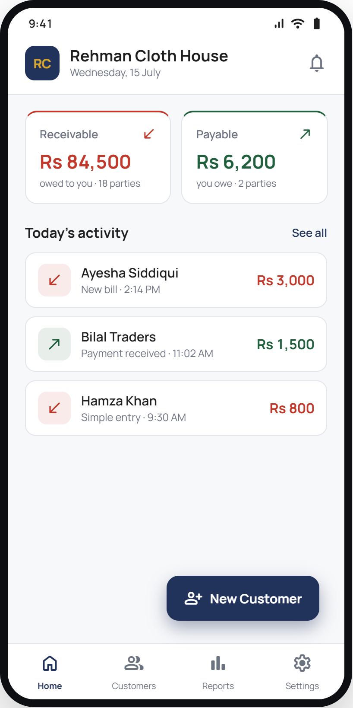<br/><sub><b>Home</b> — receivable/payable totals, today's activity</sub></td>
<td align="center">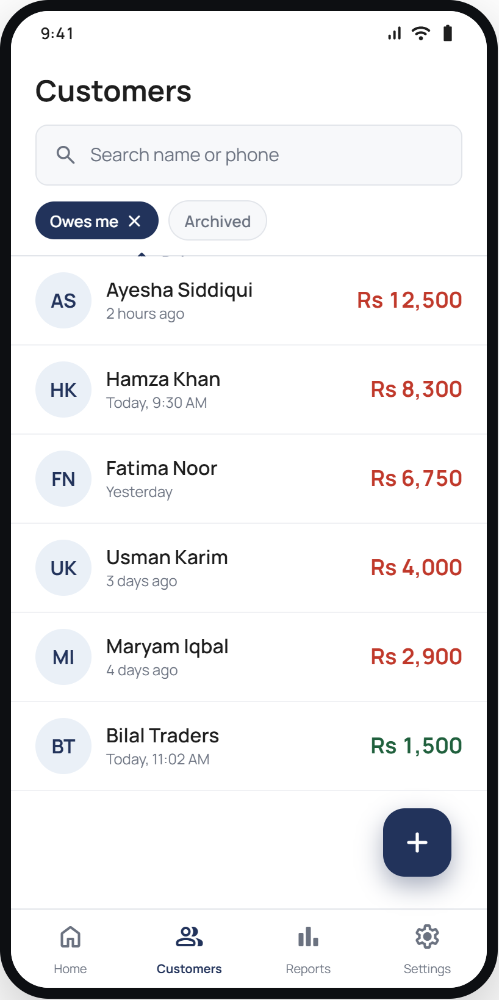<br/><sub><b>Customers</b> — search, sort, balance at a glance</sub></td>
<td align="center">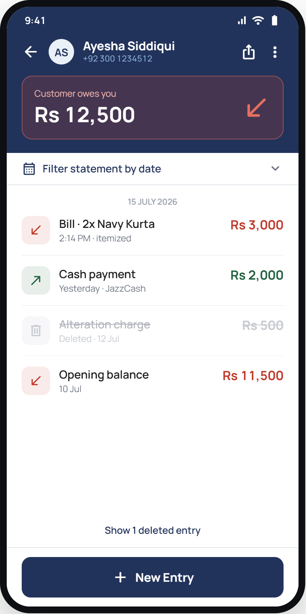<br/><sub><b>Khata</b> — color-coded balance, dated entries</sub></td>
</tr>
<tr>
<td align="center">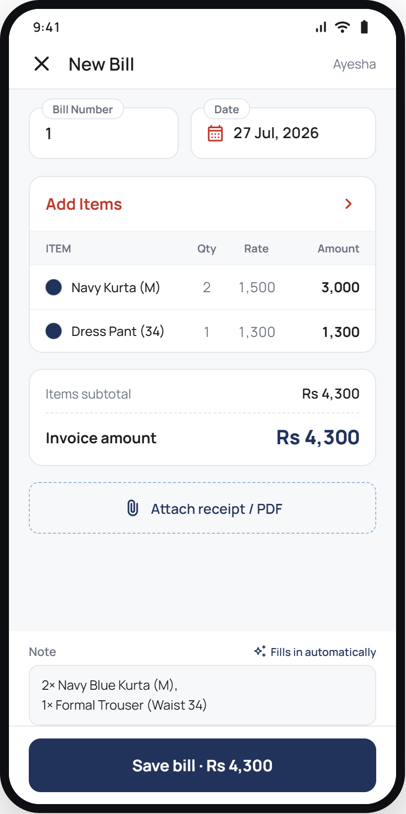<br/><sub><b>New Bill</b> — itemized line items, live total</sub></td>
<td align="center">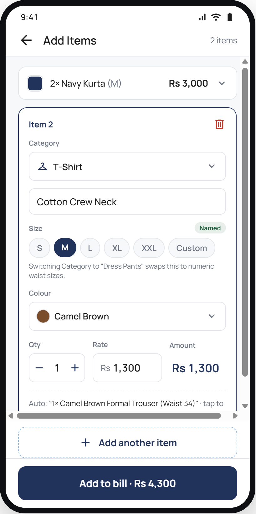<br/><sub><b>Add Items</b> — size/colour/category pickers</sub></td>
<td align="center">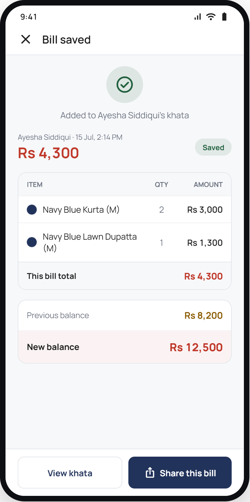<br/><sub><b>Bill saved</b> — recap + previous → new balance</sub></td>
</tr>
<tr>
<td align="center">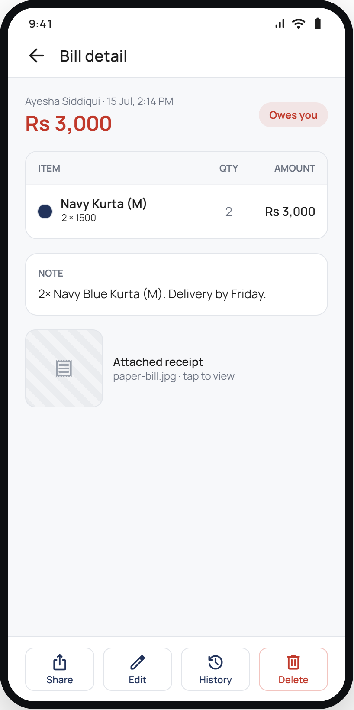<br/><sub><b>Entry detail</b> — share / edit / history / delete</sub></td>
<td align="center">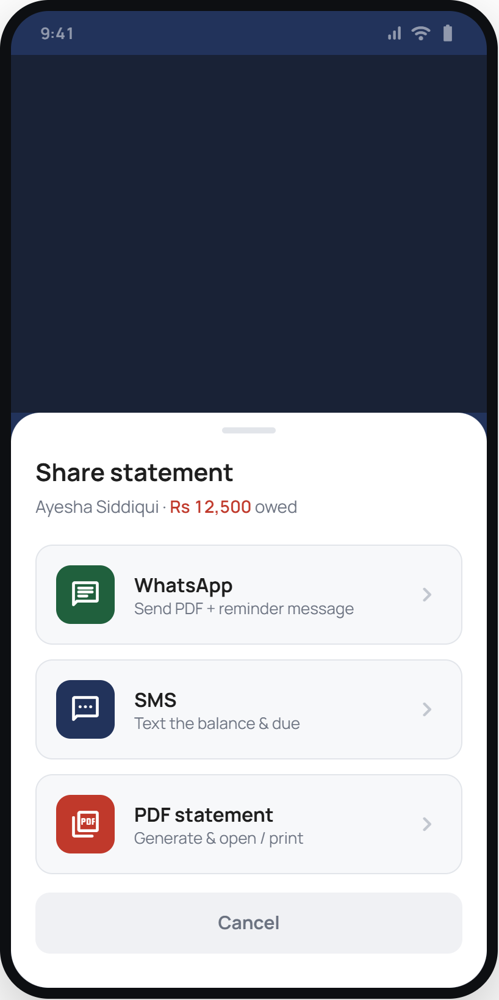<br/><sub><b>Share</b> — WhatsApp (image direct-to-chat) / SMS / PDF</sub></td>
<td align="center">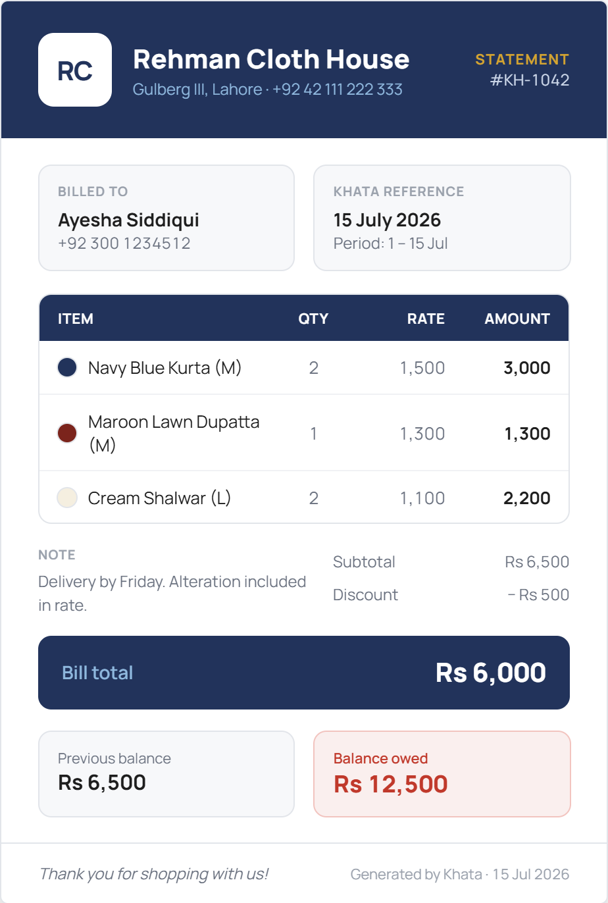<br/><sub><b>PDF receipt</b> — printable bill document</sub></td>
</tr>
<tr>
<td align="center">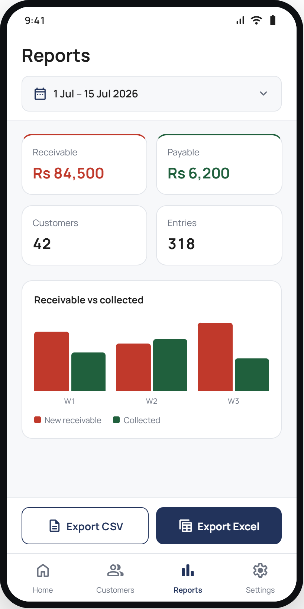<br/><sub><b>Reports</b> — totals, date range, CSV/Excel export</sub></td>
<td align="center">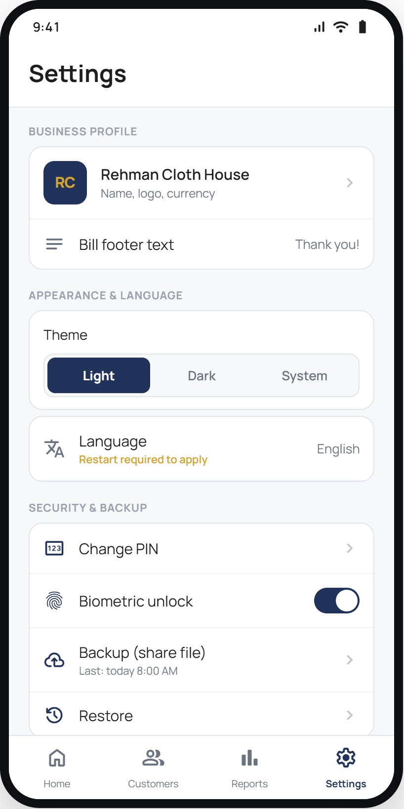<br/><sub><b>Settings</b> — profile, language, theme, PIN, backup</sub></td>
<td align="center">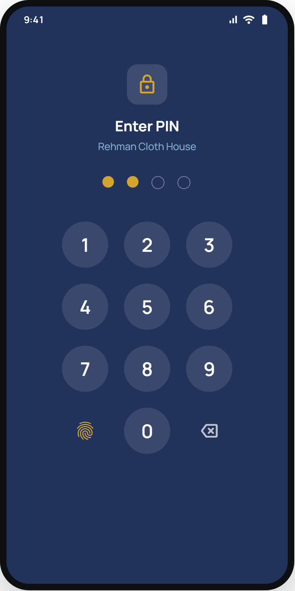<br/><sub><b>App lock</b> — PIN + biometric gate</sub></td>
</tr>
<tr>
<td align="center">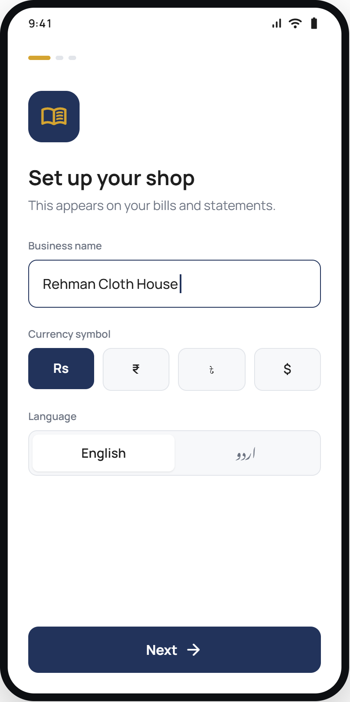<br/><sub><b>Onboarding</b> — first-run setup wizard</sub></td>
<td align="center">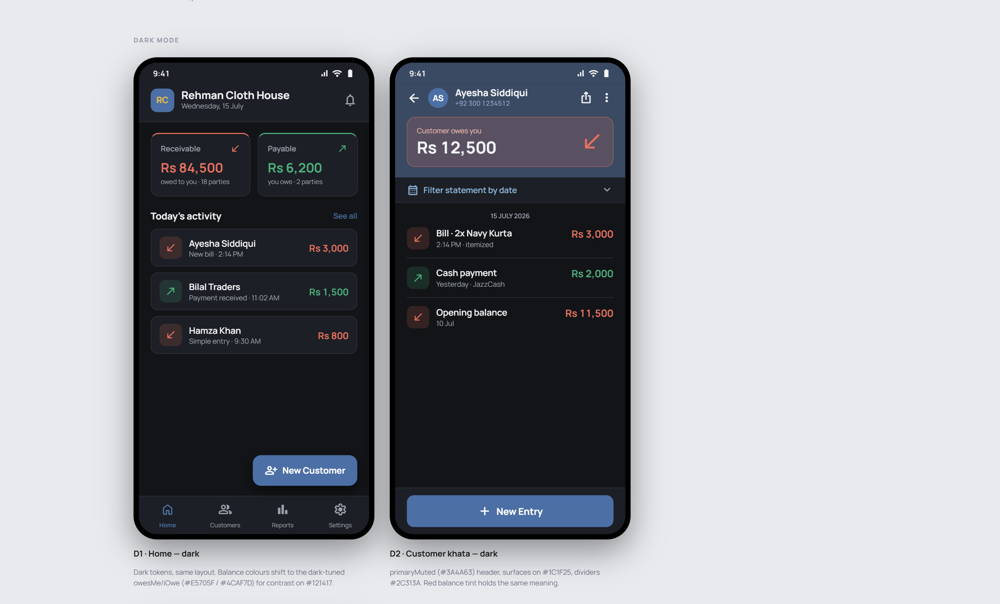<br/><sub><b>Dark theme</b> — full light/dark/system support</sub></td>
<td align="center">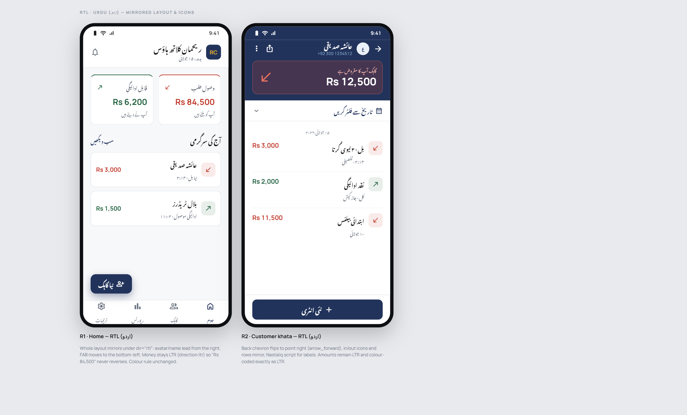<br/><sub><b>اردو (Urdu)</b> — full RTL mirrored layout</sub></td>
</tr>
</table>

More reference mockups (every screen, every state) live in [`design/`](design/); the design-token sheet is [`design/designtokens.png`](design/designtokens.png).

---

## What it does

A shop owner adds a **customer**, optionally with an opening balance carried
over from their old paper notebook. From there, every transaction is an
**entry** on that customer's khata (ledger):

- **Simple entry** — a plain cash-in/cash-out amount ("You gave Rs 2,000" /
  "You got Rs 2,000"), with a real calculator-style keypad (+ − × ÷ %) for
  the amount.
- **Itemized bill** — line items (garment name, size, colour, quantity,
  rate), each with an **auto-generated description** ("2 Maroon Cotton
  Shalwar (XL)") that updates live as fields change, unless the shopkeeper
  edits it by hand. A 14-colour garment palette plus freeform custom
  colours are supported.

The customer's **balance** is never a number someone can accidentally edit —
it's *always* recomputed from the ledger:

```
balance = openingBalance + Σ(cash_out) − Σ(cash_in)
```

Positive = the customer owes the shop (shown in **red**); negative = the
shop owes the customer (shown in **green**). This one rule is enforced
everywhere a balance is shown — the customer list, the khata header, the
home dashboard, PDF statements — so the ledger and the displayed balance can
never drift apart.

Every create/edit/delete on a customer, entry, or line item writes an
**audit log** row (old → new diff, actor, timestamp) — nothing is silently
overwritten, and a full history timeline is one tap away from any entry.
Deletes are **soft** (hidden, not destroyed) everywhere except a customer
with literally zero entries, which can be permanently removed since there's
no history to protect.

When it's time to get paid or settle up, a bill or a full statement can be:
- Sent straight into a specific customer's **WhatsApp chat** as an image
  (using WhatsApp's `jid` intent trick — no manual chat-picking), with SMS
  and generic-share fallbacks;
- Rendered as a proper **PDF** receipt/statement (`expo-print`), styled like
  a real printed shop receipt;
- **Exported** to CSV or Excel (`.xlsx`), scoped to one customer or the
  whole business, with an optional date range.

Everything — customers, bills, PDFs, exports — is generated **entirely on
the device**. There is no backend, no account, no network call anywhere in
the app.

---

## Key features

| Area | What's built |
|---|---|
| **Customers** | Search (name/phone, live, highlighted matches), sort by balance/recency, archive (soft-hide) or permanent-delete (only when zero entries), opening balance with live receivable/payable preview |
| **Khata (ledger)** | Color-coded balance banner, flat dated entry list, date-range filter (This month / Last 30 days / All time / Custom) that scopes both the on-screen list *and* share/export output, soft-deleted entries revealable on demand |
| **Entries** | Simple cash in/out with a real integer-paisa calculator keypad; itemized bills with a dedicated Add Items editor (searchable size/colour/category pickers, "used in this bill" custom-colour chips) |
| **Editing & history** | Edit any entry (pre-filled, correct form type); every mutation — including individual line items on a bill — writes an audit-log diff; a full per-entry audit timeline, including line items since removed from the bill |
| **Sharing** | WhatsApp direct-to-chat image share, SMS, PDF, generic OS share sheet — for a single bill or a full customer statement |
| **Export** | CSV and Excel (`.xlsx`) export, per-customer or business-wide, with date-range filtering |
| **Security** | 4-digit PIN (salted SHA-256, `expo-secure-store`) + biometric unlock, lockout after 5 failed attempts, auto re-lock after 2 minutes backgrounded — never on a brief switch-away like the share sheet or photo picker |
| **Onboarding** | 3-step first-run wizard: business profile + language → appearance (light/dark/system) → optional PIN + biometric |
| **Reports** | Receivable/payable totals, customer/entry counts, date-range filter, CSV/Excel export |
| **Theming** | Full light / dark / system theme, resolved live, no restart needed |
| **i18n** | English and Urdu, with a genuine mirrored **RTL** layout — not just translated strings |
| **Money** | Every amount is stored as an **integer paisa** value — never a float — eliminating the rounding bugs a real shop ledger can't afford |

---

## Tech stack

| Concern | Choice |
|---|---|
| Framework | React Native + Expo (TypeScript), SDK 57 |
| Local database | SQLite (`expo-sqlite`) + `drizzle-orm`/`drizzle-kit` for schema & migrations |
| Navigation | React Navigation — one bottom-tab navigator wrapping four native-stack navigators |
| i18n | `i18next` + `react-i18next`, `I18nManager` for Urdu RTL |
| App lock | `expo-local-authentication` (biometrics) + salted-hash PIN in `expo-secure-store` |
| Theming | `Appearance` API + a custom `ThemeContext` (light/dark palettes, `system` follows the OS) |
| PDF / images / share | `expo-print` (PDF), `react-native-view-shot` (receipt/statement → PNG), `expo-sharing` + `react-native-share` (WhatsApp/SMS deep links, direct-to-chat image share) |
| Export | `xlsx` for Excel, a hand-rolled CSV writer, `expo-file-system` for writing + sharing the file |
| App icon / splash | `expo-splash-screen`, assets rendered from an HTML/CSS composition of the Ionicons glyph set |

Full architecture rationale: [`.claude/docs/architecture.md`](.claude/docs/architecture.md).

---

## Data model

Five tables (`src/db/schema.ts`), all money in integer paisa, all IDs UUID
strings, all timestamps UTC ISO strings:

- **`customers`** — name, phone, address, opening balance, archived flag.
- **`entries`** — one movement of money (`cash_in`/`cash_out`), either
  `simple` (amount only) or `bill` (has line items); soft-deletable.
- **`line_items`** — one row on a bill: item name, size, colour, quantity,
  rate, amount, auto-generated description. Hard-deleted on bill edit (the
  one exception to "deletes are soft") — but every add/edit/remove still
  writes an audit row, so history survives even after the row itself is
  gone.
- **`audit_log`** — every create/edit/delete on a customer, entry, or line
  item: entity, action, before→after diff, actor, timestamp.
- **`settings`** — single row: business profile, language, theme, currency,
  PIN/biometric config.

Full schema reference, including the exact balance formula and the garment
colour palette: [`.claude/docs/data-model.md`](.claude/docs/data-model.md).

---

## Project structure

```
src/
  db/            schema.ts (5 Drizzle tables), client.ts (expo-sqlite + drizzle), drizzle/ (generated migrations)
  repositories/  the only layer allowed to query the database directly
  types/         app-facing TypeScript models (camelCase)
  i18n/          i18next bootstrap + en/ur resource files
  theme/         color palettes, spacing/typography tokens, ThemeContext
  navigation/    RootNavigator (tabs) + one Stack per tab + param types
  screens/       one folder per feature area — Home, Customers, Entries, Reports, Settings, Lock, Onboarding
  components/    shared presentational components (Avatar, StatCard, ActionSheet, ConfirmDialog, DateField, ...)
  lib/           pure, db-free helpers — money formatting, PDF/HTML/text builders, CSV/xlsx builders, share plumbing, PIN/biometric logic
```

The **repository layer** is the only code that talks to SQLite — screens
never import the DB client directly. This keeps the door open for a future
sync layer without touching any UI code (none exists yet; the app is
offline-only by design).

---

## Getting started

Read the versioned Expo SDK 57 docs before touching platform code:
https://docs.expo.dev/versions/v57.0.0/

```bash
npm install
npm run android   # or npm run ios
```

No device/emulator available? Verify the app still bundles cleanly:

```bash
npx tsc --noEmit
npx expo export --platform android   # build output only — safe to delete afterward
npx expo-doctor                      # should report all checks passing
```

Store builds go through EAS (`eas.json` has `development`/`preview`/`production` profiles):

```bash
eas build --platform android --profile preview
```

---

## Status

Actively in development. Full per-story progress log:
[`.claude/docs/roadmap.md`](.claude/docs/roadmap.md).

| Phase | Scope | Status |
|---|---|---|
| 0 — Foundation | Nav shell, i18n, SQLite schema, repository layer | ✅ Done |
| 1 — Customers | List/search/sort, add/edit, archive, permanent delete | ✅ Done |
| 2 — Entries & running balance | Khata screen, simple cash in/out, home dashboard | ✅ Done |
| 3 — Itemized bills | Line-item bill form, garment palette, auto-descriptions | ✅ Done |
| 4 — Edit, delete & history | Audit trail on every mutation, per-line-item diffs | ✅ Done |
| 5 — Sharing & export | WhatsApp/SMS, PDF, Excel/CSV | ✅ Done |
| 6 — Security & onboarding | PIN/biometric lock, setup wizard, light/dark/system theme | ✅ Done |
| 7 — Polish & release | Full `design/` reference redesign, empty states, accessibility, direct-to-WhatsApp image share, app icon/splash, EAS profiles | 🔶 In progress — EAS store build & full on-device QA still open |

---

## Contributing

Project conventions — data model, UI guidelines, code style, i18n rules,
git workflow, and the common-task playbook — live under
[`.claude/docs/`](.claude/docs/) and are the source of truth for how this
codebase is built:

- [`architecture.md`](.claude/docs/architecture.md) — tech stack & core rules
- [`data-model.md`](.claude/docs/data-model.md) — schema, balance formula, garment palette
- [`ui.md`](.claude/docs/ui.md) — design tokens, theming, screen-by-screen reference
- [`code-style.md`](.claude/docs/code-style.md) — TS/RN conventions, the mutation/audit pattern
- [`skills.md`](.claude/docs/skills.md) — step-by-step playbook for common tasks
- [`i18n.md`](.claude/docs/i18n.md) — adding translations, testing RTL
- [`roadmap.md`](.claude/docs/roadmap.md) — detailed phase-by-phase build log
- [`git-workflow.md`](.claude/docs/git-workflow.md) — one branch per user story

## License

See [`LICENSE`](LICENSE).
